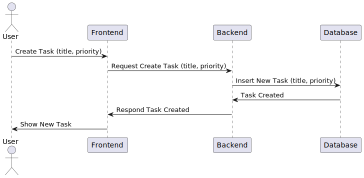
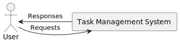
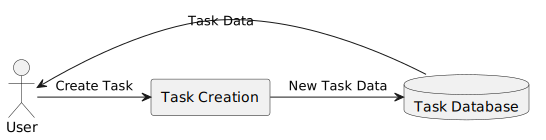
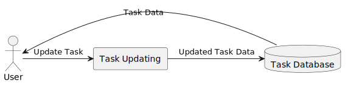
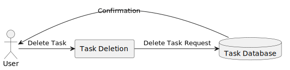
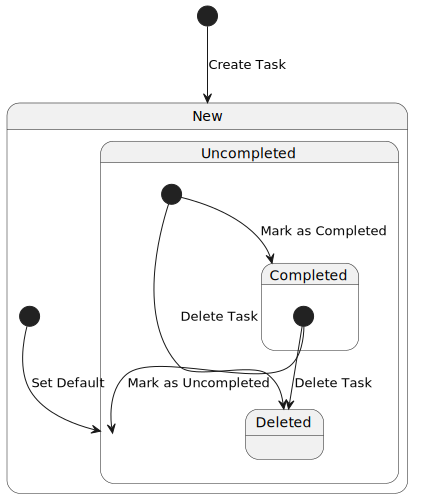

# “Just Do It” Web Application Software Requirement Specification

Version 1

18.09.2023

Olexandr Bykreev

Lead Software Engineer

## Revision History

| Date | Description | Author | Comments |
|------|-------------|--------|----------|
| 18.09.2023 | Version 1 | Olexandr Bykreev | First Revision |
| . | | | |
| . | | | |
| . | | | |

## Document Approval
 
The following Software Requirements Specification has been accepted and approved by the following:

| Signature | Printed Name | Title | Date |
|------|-------------|--------|----------|
|  | O. Bykreev | Lead Software | 01.10.2023 |
|  | A. Chupryna | Product Owner | |
|  | M. Hrynko | Developer |  |
|  | V. Mykytenko | QA Engineer | |
|  | S. Lutai | Scrum master | |

## 1. Introduction

The following document lays down the comprehensive specification for the "Just Do It" web application. The primary purpose of this document is to provide a technical blueprint which can be utilized by software engineers to build and design the software.

### 1.1 Purpose

The purpose of this SRS is to detail the specifications and requirements for the "Just Do It" web application, which is intended for individuals seeking an efficient, user-friendly task management tool. This document is intended for developers, project managers, and testers who will work on developing, implementing, and verifying the "Just Do It" web application.

### 1.2 Scope

- **Software Product**: The software product to be developed is a web-based application named "Just Do It."
- **Functionality**: The app provides users with a platform to manage their tasks, with varying features available based on their registration status. Registered users have additional capabilities, such as creating multiple todo lists and having data persisted in a cloud database.
- **Application**: The application will provide an effective task management solution with a simple and intuitive user interface, based on a well-established model like TodoMVC.

### 1.3 Definitions, Acronyms, and Abbreviations

- **CRUD**: Create, Read, Update, Delete
- **SRS**: Software Requirement Specification
- **DB**: Database

### 1.4 References

- TodoMVC - [https://todomvc.com/](https://todomvc.com/)

### 1.5 Overview

This document is divided into various sections detailing the general and specific requirements of the “Just Do It” web application. The document follows with the general description of the product, specific requirements including external interface requirements, functional requirements, and non-functional requirements, followed by analysis models, and change management process.

## 2. General Description

### 2.1 Product Perspective

The “Just Do It” web application is an independent platform inspired by existing task management models like TodoMVC.

### 2.2 Product Functions

The primary function of the application is task management where users can add, delete, edit, and toggle tasks. Registered users have additional functionalities such as managing multiple todo lists and accessing a CRUD dashboard.

### 2.3 User Characteristics

The users of the system are expected to have basic computer and internet skills. They come from various demographics and are looking for a digital tool to manage their tasks efficiently.

### 2.4 General Constraints

The web application should be designed to be responsive across multiple devices and platforms. It should be browser-agnostic and adhere to web standards.

### 2.5 Assumptions and Dependencies

- It is assumed that the PostgreSQL database will be used for data persistence for registered users.
- The application will be developed using the Next.js framework.

## 3. Specific Requirements

### 3.1 External Interface Requirements

#### 3.1.1 User Interfaces

The user interface shall be intuitive and minimalistic, providing easy navigation and access to all features.

#### 3.1.2 Hardware Interfaces

Not applicable.

#### 3.1.3 Software Interfaces

- Front-end: Next.js
- Back-end: PostgreSQL Database

#### 3.1.4 Communications Interfaces

Not applicable.

### 3.2 Functional Requirements

The main functionalities of the application are described as per the different user roles:

#### 3.2.1 Anonymous User Functions

##### 3.2.1.1 Introduction

Users without registration can utilize a basic todo list.

##### 3.2.1.2 Inputs

- Task description
- Task status (complete/incomplete)

##### 3.2.1.3 Processing

- Add, delete, rename, toggle tasks.
- Filter tasks by status.
- Toggle all tasks.
- Clear completed tasks.

##### 3.2.1.4 Outputs

- Updated todo list.

##### 3.2.1.5 Error Handling

- Invalid input characters.
- Excessive input length.

#### 3.2.2 User Authentication and Authorization

##### 3.2.2.1 Introduction
This requirement encompasses the registration, login, and logout functionalities for users.

##### 3.2.2.2 Inputs
- Registration: `email`, `name`, `password`.
- Login: `email`, `password`.
- Logout: None.

##### 3.2.2.3 Processing
- Registration: Verify email format, password strength, and unique email before creating a new User object.
- Login: Verify email and password match an existing User object, and authorize the user.
- Logout: Deauthorize the user.

##### 3.2.2.4 Outputs
- Registration: Confirmation of successful registration or error message.
- Login: Authorization token or error message.
- Logout: Confirmation of logout.

##### 3.2.2.5 Error Handling
- Registration: Provide an error message for invalid email format, weak password, or non-unique email.
- Login: Provide an error message for incorrect email or password.
- Logout: Handle any error that might occur during logout process.

#### 3.2.3 To-do List Management

##### 3.2.3.1 Introduction
This requirement encompasses the creation, deletion, and renaming of to-do lists.

##### 3.2.3.2 Inputs
- Creation: `title`.
- Deletion: `listId`.
- Renaming: `listId`, `newTitle`.

##### 3.2.3.3 Processing
- Creation: Create a new List object with a given title.
- Deletion: Delete the specified List object.
- Renaming: Update the title of the specified List object.

##### 3.2.3.4 Outputs
- Creation: Newly created List object or error message.
- Deletion: Confirmation of deletion or error message.
- Renaming: Updated List object or error message.

##### 3.2.3.5 Error Handling
- Creation: Handle errors like invalid title.
- Deletion: Handle errors like invalid `listId`.
- Renaming: Handle errors like invalid `listId` or invalid new title.

#### 3.2.4 Task Management

##### 3.2.4.1 Introduction
This requirement encompasses the creation, deletion, renaming, and status toggling of tasks.

##### 3.2.4.2 Inputs
- Creation: `title`, `priority`.
- Deletion: `taskId`.
- Renaming: `taskId`, `newTitle`.
- Status Toggling: `taskId`.

##### 3.2.4.3 Processing
- Creation: Create a new Task object with a given title and priority.
- Deletion: Delete the specified Task object.
- Renaming: Update the title of the specified Task object.
- Status Toggling: Toggle the completed status of the specified Task object.

##### 3.2.4.4 Outputs
- Creation: Newly created Task object or error message.
- Deletion: Confirmation of deletion or error message.
- Renaming: Updated Task object or error message.
- Status Toggling: Updated Task object or error message.

##### 3.2.4.5 Error Handling
- Creation: Handle errors like invalid title or priority.
- Deletion: Handle errors like invalid `taskId`.
- Renaming: Handle errors like invalid `taskId` or invalid new title.
- Status Toggling: Handle errors like invalid `taskId`.

### 3.3 Use Cases

#### 3.3.1 Use Case: Adding a New Task

- **Actor**: Anonymous/Registered User
- **Preconditions**: The user is on the main page of the application.
- **Basic Flow**:
    1. The user enters the description of the task.
    2. (For registered users) The user selects a priority for the task.
    3. The user clicks on the "Add" button.
    4. The task is added to the list.
- **Exceptions**:
    1. Invalid input characters or excessive input length will prompt an error message.

#### 3.3.2 Use Case: Deleting a Task

- **Actor**: Anonymous/Registered User
- **Preconditions**: The user has at least one task on their list.
- **Basic Flow**:
    1. The user clicks on the "Delete" button next to the task.
    2. The task is removed from the list.
- **Exceptions**:
    1. If the `taskId` is invalid, an error message is displayed.

#### 3.3.3 Use Case: Renaming a Task

- **Actor**: Anonymous/Registered User
- **Preconditions**: The user has at least one task on their list.
- **Basic Flow**:
    1. The user clicks on the task description.
    2. The user modifies the task description.
    3. The user clicks outside the text area or presses "Enter" to save the modification.
- **Exceptions**:
    1. Invalid input characters, excessive input length or invalid `taskId` will prompt an error message.

#### 3.3.4 Use Case: Toggling a Task's Completion Status

- **Actor**: Anonymous/Registered User
- **Preconditions**: The user has at least one task on their list.
- **Basic Flow**:
    1. The user clicks on the checkbox next to the task.
    2. The task's completion status is toggled.
- **Exceptions**:
    1. If the `taskId` is invalid, an error message is displayed.

#### 3.3.5 Use Case: Filtering Tasks by Status

- **Actor**: Anonymous/Registered User
- **Preconditions**: The user has at least one task on their list.
- **Basic Flow**:
    1. The user selects a status filter (e.g., All, Active, Completed).
    2. The task list updates to show only tasks matching the selected status.

#### 3.3.6 Use Case: Toggling All Tasks

- **Actor**: Anonymous User
- **Preconditions**: The user has at least one task on their list.
- **Basic Flow**:
    1. The user clicks on the "Toggle All" button.
    2. All tasks are marked as completed or active based on their current status.

#### 3.3.7 Use Case: Clearing Completed Tasks

- **Actor**: Anonymous User
- **Preconditions**: The user has at least one completed task on their list.
- **Basic Flow**:
    1. The user clicks on the "Clear Completed" button.
    2. All completed tasks are removed from the list.

#### 3.3.8 Use Case: Registering a New User

- **Actor**: Anonymous User
- **Preconditions**: The user is on the registration page of the application.
- **Basic Flow**:
    1. The user enters their email, name, and password into the corresponding fields.
    2. The user clicks on the "Register" button.
    3. The system verifies the email format, password strength, and unique email.
    4. A new User object is created and the user receives a confirmation of successful registration.
- **Exceptions**:
    1. Invalid email format, weak password, or non-unique email will prompt an error message.

#### 3.3.9 Use Case: Logging In

- **Actor**: Anonymous User
- **Preconditions**: The user is on the login page of the application.
- **Basic Flow**:
    1. The user enters their email and password into the corresponding fields.
    2. The user clicks on the "Login" button.
    3. The system verifies the email and password match an existing User object.
    4. The user receives an authorization token and is redirected to the main page.
- **Exceptions**:
    1. Incorrect email or password will prompt an error message.

#### 3.3.10 Use Case: Logging Out

- **Actor**: Registered User
- **Preconditions**: The user is logged into the application.
- **Basic Flow**:
    1. The user clicks on the "Logout" button.
    2. The user is deauthorized and redirected to the login page.
- **Exceptions**:
    1. Any error occurring during the logout process will prompt an error message.

#### 3.3.11 Use Case: Creating a New List

- **Actor**: Registered User
- **Preconditions**: The user is logged into the application.
- **Basic Flow**:
    1. The user navigates to the section to create a new list.
    2. The user enters a title for the new list.
    3. The user clicks on the "Create" button.
    4. A new List object is created and the user is directed to the newly created list.
- **Exceptions**:
    1. Invalid title will prompt an error message.

#### 3.3.12 Use Case: Deleting a List

- **Actor**: Registered User
- **Preconditions**: The user has at least one list created.
- **Basic Flow**:
    1. The user navigates to the list they wish to delete.
    2. The user clicks on the "Delete" button.
    3. The specified List object is deleted and the user is redirected to the main page.
- **Exceptions**:
    1. Invalid `listId` will prompt an error message.

#### 3.3.13 Use Case: Renaming a List

- **Actor**: Registered User
- **Preconditions**: The user has at least one list created.
- **Basic Flow**:
    1. The user navigates to the list they wish to rename.
    2. The user clicks on the title of the list, modifies it, and then clicks outside the text area or presses "Enter" to save the modification.
    3. The title of the specified List object is updated.
- **Exceptions**:
    1. Invalid `listId` or invalid new title will prompt an error message.

These use cases should now align with the updated functional requirements, covering the additional specifications and error handling scenarios provided.

### 3.4 Classes / Objects

#### 3.4.1 User

##### 3.4.1.1 Attributes
- `id`: Number, unique identifier for each user.
- `email`: String, email address of the user for login and communication.
- `name`: String, name of the user for personalization.
- `password`: Encrypted string, used for authentication.
- `lists`: Array/List of List objects, representing the to-do lists owned by the user.

##### 3.4.1.2 Functions
- `register(email, name, password)`: Registers a new user.
- `login(email, password)`: Authenticates a user.
- `logout()`: Logs out the user.
- `createList(title)`: Creates a new to-do list.
- `deleteList(listId)`: Deletes a specified to-do list.

<Reference to functional requirements and/or use cases: 3.2.1, 3.3.1 - 3.3.4, 3.3.13, 3.3.17, 3.3.18>

#### 3.4.2 List

##### 3.4.2.1 Attributes
- `id`: Number, unique identifier for each to-do list.
- `title`: String, title of the to-do list.
- `ownerId`: Number, identifier of the user who owns the list.
- `tasks`: Array/List of Task objects, representing the tasks within the to-do list.

##### 3.4.2.2 Functions
- `createTask(title, priority)`: Creates a new task in the list.
- `deleteTask(taskId)`: Deletes a specified task from the list.
- `renameList(newTitle)`: Renames the to-do list.

<Reference to functional requirements and/or use cases: 3.2.1, 3.3.5 - 3.3.12, 3.3.14 - 3.3.15>

#### 3.4.3 Task

##### 3.4.3.1 Attributes
- `id`: Number, unique identifier for each task.
- `title`: String, title of the task.
- `completed`: Boolean, indicates whether the task is completed or not.
- `listId`: Number, identifier of the list to which the task belongs.
- `priority`: Enum (Low, Medium, High), priority level of the task.

##### 3.4.3.2 Functions
- `toggleStatus()`: Toggles the status of the task between completed and not completed.
- `renameTask(newTitle)`: Renames the task.
- `changePriority(newPriority)`: Changes the priority of the task.

<Reference to functional requirements and/or use cases: 3.2.1, 3.3.6 - 3.3.12>

The attributes and functions within each class represent the data model and the operations that can be performed on the data respectively. These classes will be utilized in building the backend logic of the "Just Do It" application to ensure all user requirements and use cases are met effectively. The design of these classes will facilitate the implementation of front-end components and ensure a cohesive flow of data within the application.

### 3.5 Non-Functional Requirements

#### 3.5.1 Performance

- The app should load fast, in 3 seconds or less, on a normal broadband connection.
- Most actions in the app (95%) should happen almost instantly, in less than 1 second.

#### 3.5.2 Reliability

- The system should be very reliable, with downtime of only 1 minute per day at most.

#### 3.5.3 Scalability

- The system should work well even when 1,000 users are using it at the same time.
- The database should be able to grow quickly as more users join, with a growth rate of 10% each month.

#### 3.5.4 Security

- All user data should be protected by encryption whether it's being moved or stored.
- Passwords should be securely stored using strong cryptography.
- Security checks should be done twice a year to find and fix vulnerabilities.

#### 3.5.5 Usability

- The app should look good and work well on both phones and computers.
- The design should be user-friendly, making the app easy to navigate and use.

#### 3.5.6 Backup and Recovery

- A full backup of user data should be done every day.
- Backups should be kept in a different place to protect against regional disasters.

### 3.6 Inverse Requirements

Not specified.

### 3.7 Design Constraints

- The application shall be implemented using Next.js for the frontend.
- The application shall use PostgreSQL for backend data storage.

### 3.8 Logical Database Requirements

- PostgreSQL will be used to store registered user data and their respective todo lists.
- Data integrity, retention, and storage capabilities shall adhere to best practices for database management.

### 3.9 Other Requirements

Not specified.

## 4. Analysis Models

### 4.1 Sequence Diagrams

### 4.2 Data Flow Diagrams (DFD)

### 4.3 State-Transition Diagrams (STD)

## 5. Change Management Process

- All change requests shall be submitted through a designated project management tool (Trello).
- Change requests shall be reviewed and approved by the project manager before being implemented.
- The SRS document will be updated accordingly to reflect approved changes.
